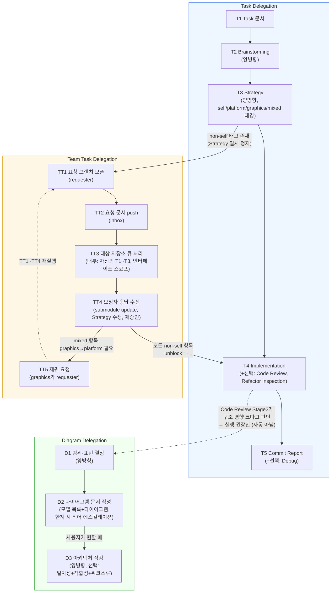

# 딜리게이터 개요 다이어그램

`agent_harness/agent_harness`가 정의하는 3개 워크 딜리게이터(Task Delegation, Team Task Delegation, Diagram Delegation)의 Step 흐름과 상호 트리거 관계를 다룬다.

---

## Step 1 — 범위와 표현 (확정)

- 대상 범위: 3개 커맨드 문서가 정의하는 워크플로우 자체 — `.claude/commands/task_delegation.md`, `.claude/commands/team_task_delegation.md`, `.claude/commands/diagram_delegation.md`. 코드베이스가 아니라 프로세스 구조.
- 뷰 집합: 표준 뷰(시스템 맵/클래스/생명주기/런타임) 중 어느 것에도 해당하지 않는 커스텀 뷰 1개 — "딜리게이터 프로세스 흐름도".
- 아트 티어: Mermaid flowchart. 사유 — Team Task Delegation에 분기(target/requester 역할, `[mixed]` 케이스에서의 재귀 요청)가 있고 3개 워크플로우가 서로 트리거하는 병렬 구조라 ASCII의 12노드/거의 planar 조건을 넘어섬. 노드 수(~20개)가 HTML 승격 조건(약 50 초과, 필터/드릴다운 필요)에는 못 미쳐 Mermaid로 충분.

사용자 승인 완료.

---

## Step 2 — 모델 목록

### 엔티티 (Step 노드)

**Task Delegation**
- T1 Task 문서 작성
- T2 Brainstorming (양방향)
- T3 Strategy (양방향, 체크리스트 항목에 `[self]`/`[platform]`/`[graphics]`/`[mixed]` 태그)
- T4 Implementation (+ 선택: Code Review, Refactor Inspection)
- T5 Commit Report (+ 선택: Debug)

**Team Task Delegation** (Task Delegation Step 3에서 non-`[self]` 항목이 있을 때만 진입)
- TT1 요청 브랜치 오픈 (requester)
- TT2 요청 문서 작성·push → inbox
- TT3 대상 저장소가 큐 처리 — 내부적으로 그 저장소 자신의 Task Delegation 사이클(T1~T3 스코프를 인터페이스 설계로 축소)을 돌림 → 응답 문서 → outbox, merge, 버전 태깅
- TT4 요청자가 응답 수신 — submodule update, Strategy 문서 수정, 재승인
- TT5 재귀 요청 — `[mixed]` 항목에서 graphics가 platform에 대해 requester가 되는 경우, TT1~TT4를 다시 밟음

**Diagram Delegation** (사용자가 직접 트리거, Task Delegation과 독립)
- D1 범위·표현 결정 (양방향)
- D2 다이어그램 문서 작성 (모델 목록 + 다이어그램, 절대 한계 부딪히면 티어 에스컬레이션)
- D3 아키텍처 점검 (양방향, 선택) — 일치성 검사 + 적합성 리뷰 + 워크스루

### 관계 (엣지)

- T1 → T2 → T3 (Task Delegation 순차, T2/T3는 승인 루프)
- T3 -- "항목에 non-self 태그 존재" --> TT1 (Team Task Delegation 진입, T3 일시 정지)
- TT1 → TT2 → TT3 → TT4 -- "모든 non-self 항목 unblock" --> T4 (Task Delegation 재개)
- TT3 내부: 대상 저장소의 T1~T3 사이클 (점선으로 별도 표시 — 동일 구조 재사용)
- TT4 -- "`[mixed]` 항목, graphics가 platform 필요" --> TT5 -- "TT1~TT4 재실행" --> TT4
- T4 → T5
- T4 -- "Code Review Stage 2가 구조 영향 크다고 판단 시 권장만 (자동 실행 아님)" --> D1
- D1 → D2 -- "사용자 요청 시" --> D3
- Task Delegation 전체와 Diagram Delegation은 서로 독립 — Diagram Delegation은 Task Delegation을 거치지 않고 사용자가 직접 시작 가능 (자연어 트리거)

---

## 다이어그램

---

## 참고 — 3개 딜리게이터의 독립성

- Task Delegation은 단일 저장소 작업의 기본 사이클이다. cross-repo 의존이 없는 항목은 이것만으로 끝난다.
- Team Task Delegation은 Task Delegation Step 3에서 `[self]`가 아닌 항목이 있을 때만 끼어드는 하위 워크플로우다. 독자적으로 시작되지 않는다.
- Diagram Delegation은 앞의 둘과 완전히 독립이다. Task Delegation을 거치지 않고 사용자가 직접 트리거하며, 코드 작업이 아니라 문서화 워크플로우다. Code Review Stage 2가 구조 영향이 크다고 판단해도 실행을 "권장"만 할 뿐 자동으로 이어지지 않는다.

---

## 산출물

이 문서 자체가 산출물이다. `docs/DiagramDelegation/diagrams/`에 영구 보관되며, 이후 3개 딜리게이터의 Step 구성이 바뀌면 새 날짜별 파일이 추가되어 변경 이력이 diff로 드러난다.

사용자가 다이어그램 기준 점검(Step 3)을 원하지 않아 이 문서 작성으로 워크플로우를 종료한다.

---

## 요약

- Task Delegation, Team Task Delegation, Diagram Delegation 3개 딜리게이터의 Step 흐름과 상호 트리거 관계를 Mermaid flowchart 한 장으로 그렸다.
- 대상은 코드베이스가 아니라 `.claude/commands/` 의 3개 커맨드 문서가 정의하는 프로세스 구조다.
- Team Task Delegation 은 Task Delegation Step 3 에서 `[self]` 가 아닌 항목이 있을 때만 끼어드는 하위 워크플로우이고, 독자적으로 시작되지 않는다.
- Diagram Delegation 은 앞의 둘과 독립이며 사용자가 직접 트리거한다. Code Review Stage 2 는 실행을 권장만 할 뿐 자동으로 잇지 않는다.
- 이 문서 자체가 산출물이고 `docs/DiagramDelegation/diagrams/` 에 영구 보관된다. 아카이브 대상이 아니다.

## 사용자 결정 사항

1. 대상 범위를 코드베이스가 아니라 3개 커맨드 문서가 정의하는 워크플로우 자체로 정했다. 그 결과 뷰가 시스템 맵·클래스·생명주기·런타임 어디에도 해당하지 않는 커스텀 뷰 1개가 되었다.
2. 아트 티어를 Mermaid flowchart 로 정했다. 분기와 병렬 구조가 ASCII 의 12노드 조건을 넘고, 노드 약 20개는 HTML 승격 조건에 못 미치기 때문이다.
3. 다이어그램 기준 아키텍처 점검(Step 3)을 하지 않기로 했다. 그 결과 이 문서 작성으로 워크플로우를 종료했다.

## 사용자 확인 사항

1. 3개 딜리게이터의 Step 구성이 바뀌면 이 문서를 고칠까, 새 날짜 파일을 추가할까? 권장은 새 파일 추가다. 스냅샷이 날짜별로 쌓여야 구조 변화가 diff 로 드러나기 때문이다. 고치는 쪽을 택하면 변경 이력이 사라진다.
