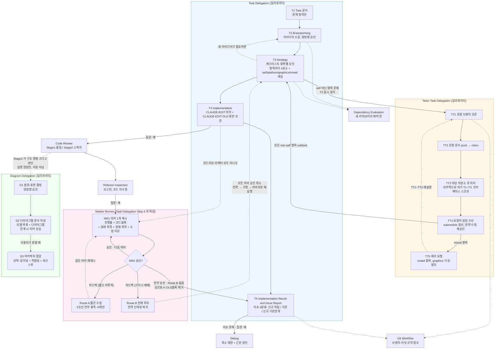

# 딜리게이터 개요 다이어그램 (2026-09-08)

`agent_harness/agent_harness`가 정의하는 워크플로우의 Step 흐름과 상호 트리거 관계를 다룬다.

직전 스냅샷은 `딜리게이터개요_20260904_0155.md` 다.
그 문서 이후 2026-09-08 에 들어온 마커 리뷰·전략 항목별 승인·이슈 3분류를 반영하기 위해 새 날짜 파일로 작성했다.
직전 문서를 덮어쓰지 않는다. 두 파일의 diff 가 워크플로우 변경 이력이다.

---

## Step 1 — 범위와 표현 (확정)

### 대상 범위

`.claude/commands/` 의 커맨드 문서가 정의하는 워크플로우 자체를 다룬다.
코드베이스가 아니라 프로세스 구조다.

직전 스냅샷은 커맨드 문서 3개를 대상으로 했다.
이번에는 대상이 9개로 늘었고, 역할이 두 층으로 갈린다.

- 딜리게이터 3개 — `task_delegation.md`, `team_task_delegation.md`, `diagram_delegation.md`.
- 딜리게이터가 호출하는 하위 절차 6개 — `marker_review.md`, `code_review.md`, `refactor.md`, `debug.md`, `dependency_eval.md`, `git_workflow.md`.

`marker_review.md` 를 하위 절차로 분류한 근거는 다음과 같다.
Task Delegation Step 4 안에서만 진입하고, 사용자가 독립적으로 시작하는 경로가 없다.
문서 스스로도 Marker Review 가 Task Delegation 워크플로우의 확장이지 별개 절차가 아니라고 밝히고 있다.

### 직전 스냅샷이 놓치고 있던 것

이번 갱신이 채우는 구멍이다.

- 마커 리뷰가 통째로 없었다. 2026-09-08 에 생긴 `marker_review.md` 가 그림에 존재하지 않았다.
- 마커 리뷰의 Route B 피드백이 Step 3 전략으로 되돌아가는 되먹임 간선이 없었다. 횟수 제한이 없는 반복 루프다.
- 되돌아갈 때 기존 마커 승인이 전부 취소된다는 조건이 없었다.
- Step 3 전략의 승인 단위가 문서 전체에서 체크리스트 항목별로 바뀐 것이 반영되지 않았다.
- Step 4 의 `[CLAUDE-EDIT]` 와 `[CLAUDE-EDIT-OLD]` 마커 규약이 없었다.
- Step 5 이름이 Commit Report 로 되어 있었다. 현재 이름은 Implementation Result and Issue Report 이고 이슈를 3분류한다.

### 뷰 집합

표준 뷰 4종(시스템 맵 / 클래스 / 생명주기 / 런타임) 중 어디에도 해당하지 않는 커스텀 뷰 1개를 쓴다.
뷰 이름은 딜리게이터 프로세스 흐름도다.

대상이 코드가 아니라 프로세스이므로 표준 뷰 4종은 전부 해당 없음이다.
클래스도 객체 생명주기도 스레드도 없다.

### 아트 티어

Mermaid flowchart 를 쓴다.

- ASCII 로는 안 된다. 노드가 약 25개로 12개 한계를 넘고, 마커 리뷰 되먹임과 Team Task Delegation 재귀 요청 때문에 planar 가 아니다.
- HTML 로 올릴 필요는 없다. 약 50 노드 초과도 아니고 필터나 드릴다운 없이 읽힌다.

직전 스냅샷과 같은 티어다.
노드가 약 20개에서 25개로 늘었을 뿐 티어 경계를 넘지 않아 에스컬레이션하지 않았다.

사용자 승인 완료.

---

## Step 2 — 모델 목록

다이어그램과 대조할 수 있도록 평문으로 먼저 적는다.

### 엔티티 — Task Delegation

- **T1 Task 문서** — 문제 정의만 쓴다. 해법과 코드 변경 방법을 넣지 않는다. 산출물은 `docs/task/{slug}_YYYYMMDD_HHMM.md`.
- **T2 Brainstorming** — 아이디어 수준의 논의만 한다. 실현 가능성 판단을 위한 코드 읽기는 허용하고, 파일·함수 단위 설계는 금지한다. 양방향 승인 루프. 산출물은 `docs/brainstorming/`.
- **T3 Strategy** — 브레인스토밍 결과를 코드에 어떻게 적용할지 구체화한다. 새 아이디어가 필요해지면 T2 로 돌아간다. 산출물은 `docs/strategy/`.
- **T4 Implementation** — 승인된 체크리스트대로 구현한다. 변경 지점마다 `[CLAUDE-EDIT]` 마커를 달고, 수정하거나 지운 원본은 `[CLAUDE-EDIT-OLD]` 주석으로 남긴다.
- **T5 Implementation Result and Issue Report** — 현재 상태에서 식별된 오류만 보고한다. 산출물은 `docs/commit/`.

### 엔티티 — Task Delegation 안의 선택 절차

세 가지 모두 사용자가 예 또는 아니오로 답하는 질문을 거쳐 진입한다. 자동 실행이 아니다.

- **Code Review** — Stage 1 은 SOLID·라이브러리 격리·테스트·주석 규칙 품질 점검이다. Stage 2 는 class 와 sequence 스케치다.
- **Refactor Inspection** — 단일 책임 위반, 결합도, 누락된 테스트, 이름 문제를 훑는다. 보고만 하고 코드를 고치지 않는다.
- **Debug** — T5 가 이슈를 냈을 때만 묻는다. 최소 재현 스크립트를 쓰고 근본 원인을 추적한다.

### 엔티티 — Marker Review 내부

- **MR1 마커 1개 제시** — 진행률과 함께 실제 코드 블록, 원래 코드의 목적 및 기능, 현재 코드의 목적 및 기능, 수정 이유 네 가지를 보인다. 한 턴에 정확히 하나만 제시한다.
- **MR2 승인 여부 판정** — 승인이면 다음 마커로 간다. 피드백이면 요구되는 변경의 크기에 따라 Route A 와 Route B 로 갈린다.
- **Route A 짧은 수정** — 다섯 조건을 전부 만족할 때만 쓴다. 한 파일 안에서 끝나고, 다른 모듈의 동작과 인터페이스를 건드리지 않고, 기능을 더하거나 빼지 않고, 수십 줄 규모이고, 새 단위 테스트가 필요 없어야 한다. 하나라도 어긋나거나 애매하면 Route B 다.
- **Route B 전체 루프** — 전략 단계로 돌아간다. 이때 기존 마커 승인이 전부 취소된다.

### 엔티티 — Team Task Delegation

Task Delegation Step 3 에서 `[self]` 가 아닌 항목이 있을 때만 진입한다.

- **TT1 요청 브랜치 오픈** — 요청자 쪽에서 연다.
- **TT2 요청 문서 작성과 push** — 대상 저장소의 `docs/TeamTaskDelegation/inbox/` 로 보낸다.
- **TT3 대상 저장소 큐 처리** — 대상 저장소가 자기 Task Delegation 사이클을 인터페이스 설계 스코프로 축소해 돌린다. 응답 문서를 `outbox/` 에 놓고 merge 한 뒤 버전을 태깅한다.
- **TT4 요청자 응답 수신** — submodule 을 갱신하고 전략 문서를 고친 뒤 다시 승인받는다.
- **TT5 재귀 요청** — `[mixed]` 항목에서 graphics 가 platform 에 대해 다시 요청자가 되는 경우다. TT1 부터 TT4 까지를 다시 밟는다.

### 엔티티 — Diagram Delegation

사용자가 직접 트리거한다. Task Delegation 을 거치지 않는다.

- **D1 범위와 표현 결정** — 대상 범위, 뷰 집합, 아트 티어를 확정한다. 양방향 승인이다.
- **D2 다이어그램 문서 작성** — 모델 목록을 먼저 평문으로 쓰고 다이어그램을 렌더한다. 절대 한계에 부딪히면 티어를 올리고 이유를 기록한다.
- **D3 아키텍처 점검** — 선택이다. 일치성 검사, 심각도 등급이 매겨진 적합성 리뷰, 산문형 워크스루를 낸다.

### 엔티티 — 흐름 밖의 하위 절차

선형 흐름의 한 칸이 아니라 필요할 때 옆에서 불려 나오는 것들이다.

- **Dependency Evaluation** — 새 외부 라이브러리를 채택하기 전에 돌린다. 대안을 2개 이상 비교한다. 채택 여부가 논의되는 T2 브레인스토밍과 T3 전략 근처에서 불린다.
- **Git Workflow** — 브랜치 전략과 커밋 규약의 참조 문서다. Team Task Delegation 의 요청 브랜치 개설과 Task Delegation 마무리에서 참조한다.

### 관계 — 간선

- T1 에서 T2, T3, T4, T5 로 이어지는 것이 기본 순차다. T2 와 T3 는 각각 승인 루프를 갖는다.
- T3 는 체크리스트 항목을 하나씩 승인받는다. 한 턴에 한 항목만 제시하고, 승인되면 항목 앞에 `(승인됨)` 을 붙인다. `## 사용자 확인 사항` 이 `없음` 이 되어야 T4 로 넘어간다.
- T3 에서 T2 로 돌아가는 간선이 있다. 전략 단계에서 새 아이디어가 필요해지면 브레인스토밍으로 되돌린다.
- T3 에서 `[self]` 가 아닌 항목이 있으면 TT1 로 간다. 이때 T3 는 일시 정지한다.
- TT4 에서 모든 non-self 항목이 풀리면 T3 로 복귀해 전략 문서를 확정한 뒤 T4 로 간다.
- TT4 에서 `[mixed]` 항목이 남으면 TT5 로 가고, TT1 부터 TT4 까지를 다시 실행한다.
- T4 다음에 Code Review, Refactor Inspection, Marker Review 순으로 각각 사용자에게 묻는다. 아니오면 다음 질문으로 건너뛴다.
- Code Review 에서 고친 코드도 `[CLAUDE-EDIT]` 마커를 단다. 따라서 Marker Review 의 범위는 구현 단계와 코드 리뷰 단계 양쪽이다.
- Marker Review 내부는 MR1 에서 MR2 로 간다. 승인이면 다음 마커를 제시한다. Route A 면 즉시 수정한 뒤 같은 마커를 MR1 로 다시 제시한다. Route B 면 T3 로 되돌아가며 모든 마커 승인을 취소한다.
- Marker Review 종료 조건은 Route B 피드백이 하나도 없고 모든 마커가 승인된 상태다. 종료할 때 승인 표시와 `[CLAUDE-EDIT-OLD]` 블록을 걷어내고 T5 로 간다.
- T5 가 이슈를 내면 Debug 실행 여부를 묻는다.
- Code Review Stage 2 가 구조 영향이 크다고 판단하면 D1 실행을 권장만 한다. 인라인 자동 실행은 금지다.
- Diagram Delegation 은 사용자 트리거로 D1 에서 직접 시작한다. D1 에서 D2 로 가고, 사용자가 원할 때만 D3 로 간다.

---

## 다이어그램 — 딜리게이터 프로세스 흐름도

---

## 참고 — 세 딜리게이터의 독립성

- Task Delegation 은 단일 저장소 작업의 기본 사이클이다. cross-repo 의존이 없으면 이것만으로 끝난다.
- Team Task Delegation 은 Task Delegation Step 3 에서 `[self]` 가 아닌 항목이 있을 때만 끼어드는 하위 워크플로우다. 독자적으로 시작되지 않는다.
- Diagram Delegation 은 앞의 둘과 완전히 독립이다. 사용자가 직접 트리거하며 코드 작업이 아니라 문서화 워크플로우다.
- Marker Review 는 네 번째 딜리게이터가 아니다. Task Delegation Step 4 의 확장이며 그 안에서만 진입한다.

---

## 참고 — 승인 게이트가 두 번인 이유

이 워크플로우에는 사용자 승인 게이트가 구현 전후로 하나씩 있다.

- 구현 전 게이트는 Step 3 전략의 항목별 승인이다. 무엇을 어떻게 바꿀지 합의한다.
- 구현 후 게이트는 Marker Review 다. 실제로 바뀐 코드의 수준과 깊이를 합의한다.

둘은 대칭이다.
전략 항목이 네 요소를 갖추도록 요구하는 것과, 마커 리뷰가 같은 네 가지를 제시하도록 요구하는 것이 같은 이유에서 나왔다.
네 요소는 Before 와 After, 현재 코드의 목적 및 기능, 변경 후 코드의 목적 및 기능, 수정 이유다.
계획한 변경과 실제 변경을 같은 형식으로 놓고 대조할 수 있어야 하기 때문이다.

---

## 산출물

이 문서 자체가 산출물이다.
`docs/DiagramDelegation/diagrams/` 에 영구 보관하며 아카이브하지 않는다.
워크플로우 구성이 다시 바뀌면 새 날짜 파일을 추가한다.

사용자가 Step 3 아키텍처 점검을 원하지 않아 이 문서 작성으로 워크플로우를 종료한다.

---

## 요약

- 2026-09-08 기준 딜리게이터 프로세스 흐름도 스냅샷이다. 직전 `딜리게이터개요_20260904_0155.md` 가 반영하지 못한 마커 리뷰, 전략 항목별 승인, 이슈 3분류를 채웠다.
- 대상은 `.claude/commands/` 커맨드 문서 9개다. 딜리게이터 3개와 하위 절차 6개로 갈린다.
- Marker Review 는 별도 딜리게이터가 아니라 Task Delegation Step 4 의 확장이다. Route B 피드백이 나오면 전략 단계로 되돌아가고 그때 모든 마커 승인이 취소된다. 반복 횟수 제한이 없다.
- 승인 게이트가 구현 전후로 두 번 있다. 전략 항목별 승인과 마커 리뷰가 같은 네 요소를 요구하는 대칭 구조다.
- 표현은 커스텀 뷰 1개를 Mermaid flowchart 로 그렸다. 노드 약 25개로 ASCII 한계는 넘고 HTML 승격 조건에는 못 미쳐 티어를 올리지 않았다.

## 사용자 결정 사항

1. 직전 스냅샷을 고치지 않고 새 날짜 파일로 만들기로 했다. 그 결과 두 파일의 diff 가 워크플로우 변경 이력으로 남는다.
2. 대상 범위를 커맨드 문서 9개 전부로 정했다. 그 결과 마커 리뷰와 그 되먹임 루프가 그림에 들어갔다.
3. 아트 티어를 직전과 같은 Mermaid flowchart 로 유지했다. 그 결과 두 스냅샷을 나란히 놓고 비교할 수 있다.
4. Step 3 아키텍처 점검을 하지 않기로 했다. 그 결과 이 문서 작성으로 워크플로우를 종료했다.

## 사용자 확인 사항

1. 없음.
